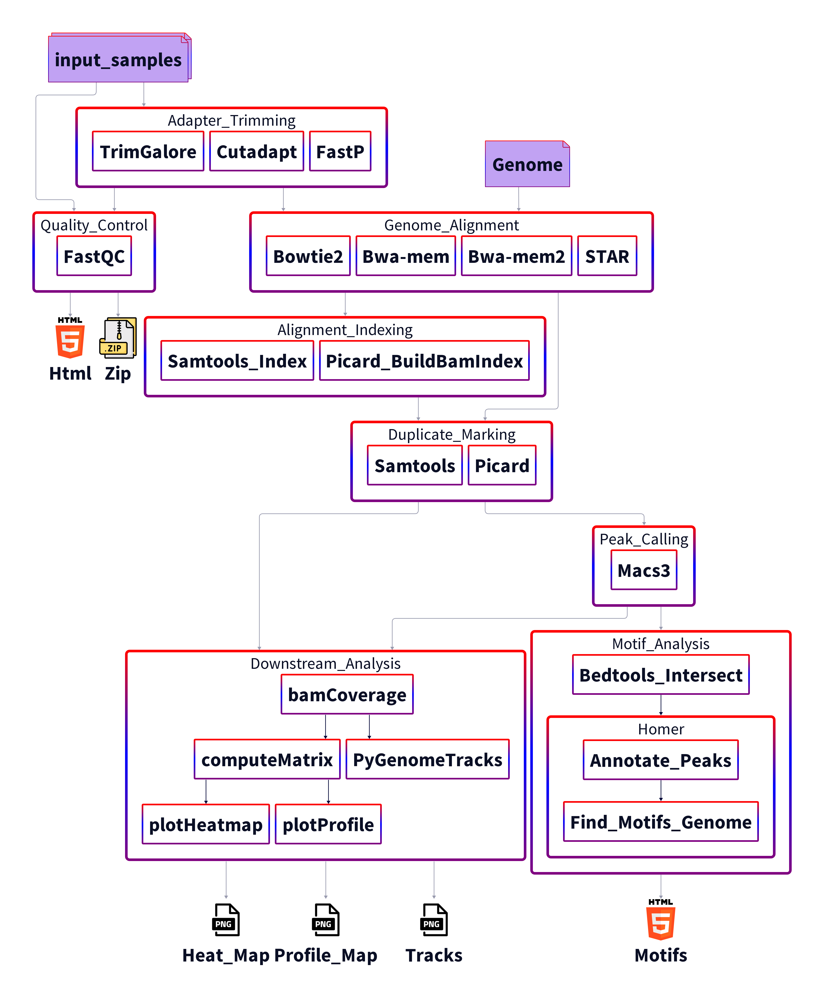

# ChIP-Seq Pipeline

Snakemake reproducible and extensible chromatin immunoprecipitation sequencing data analysis pipeline.




# Usage

## Conda

Installation of conda and snakemake is required to run the pipeline. 

Install conda by following the instructions provided by the official conda [documentation](https://docs.conda.io/projects/conda/en/stable/user-guide/install/index.html)

Then install snakemake by running:

`conda create snakemake -n snakemake -c conda-forge -c bioconda`

Activate the environment and start using the pipeline:

`conda activate snakemake`

Inside the git repository run:

`snakemake -c <num_cores> -j <num_jobs> -C <config_options>`

## Apptainer/Singularity

Using Singularity and Apptainer it is possible run the pipeline without installing Snakemake and conda locally.

Run:

`apptainer pull container_name docker://arnasrum/chippipeline`

Snakemake together conda is available for use in the container.

Run the pipeline by running the following commands inside the git repository:

`./container.sif -c <num_cores> -j <num_jobs> -C <config_options>`

or more explicitly

`apptainer exec container.sif snakemake --sdm conda --conda-frontend conda -c <num_cores> -j <num_jobs> -C <config_options>`

N.B. remember to bind the working directory if it is outside the home directory.


## Specify samples 

Define experiment samples by editing the [config/samples.csv](./config/samples.csv). 

[config/samples.csv](./config/samples.csv) support both publicly available samples and local samples on the machine.

For publicly available samples please provide their GEO accession in the [config/samples.csv](./config/samples.csv).

For local samples please provide a path to the sample. 

<table>
    <th>Column</th>
    <th>Description</th>
    <th>Required</th>
    <tr>
        <td>Mark</td>
        <td>For treatment files defines the transcription factor or histone mark.</td>
        <td>Only for treatment samples</td>
    </tr>
    <tr>
        <td>Sample</td>
        <td>The sample the sequences were obtained from.</td>
        <td>Yes</td>
    </tr>
    <tr>
        <td>Type</td>
        <td>Must be either treatment/control, defines if the sample will be used input or control.</td> 
        <td>Yes</td>
    </tr>
    <tr>
        <td>Peak_type</td>
        <td>Must be narrow/broad, decides if the peak caller will treat the sample as narrow or broad peaks.</td>
        <td>Yes</td>
    </tr>
    <tr>
        <td>Accession</td>
        <td>GEO accession that will be used to download the sample. If file_path is defined the column will be used as a prefix for the file name.</td>
        <td>Yes; if file_path is not defined.</td>
    </tr>    
    <tr>
        <td>File_path</td>
        <td>Paths to the reads sample reads. If paired_end is set to true, then two paths must be defined in the column by separating them with ";" character</td>
        <td>No</td>
    </tr>

</table>

### Example sample sheet

```
mark,sample,type,replicate,peak_type,accession,file_path 
H3K4me3,8cell,treatment,1,narrow,GSM0000001,
H3K4me3,8cell,treatment,2,narrow,GSM0000002,
,8cell,control,1,,GSM0000004, #
,8cell,control,2,,GSM0000005,path/to/read1;path/to/read2
H3K18ac,oocytes,treatment,1,narrow,file_name,path/to/read1;path/to/read2
```
Note: if the samples are single-end reads only include one path 

## Editing Config 

Changing the behavior of the pipeline or individual tools can be done either at runtime time by providing arguments 
through the CLI with `-C` or `--config` flags, or by editing the [config](config/config.yaml) directly.

### Options

`paired_end`: true/false, all samples defined in the sample sheet must be same.

`genome`: either genome code or path to genome file.

`sample_sheet`: path to a csv sample sheet. If not defined "config/samples.csv" will be used as default.

`prefix`: path for writing generated files to.

`trimmer`: trim_galore/cutadapt/fastp, choose tool to use for trimming samples.

`aligner`: bowtie2/bwa-mem/bwa-mem2/STAR, choose tool to use for genome alignment.

`modules`: Allows the user to use shorthand flags choose tools. 


## Module Options

Overwrite the default configuration by running:

`snakemake -c <num> <rule> --config modules="--flag1 <value1> --flag2 <value2>"`

## Flags

**-t** or **--trim** overwrites the trimmer

**-a** or **--align** overwrites the aligner

**-g** or **--genome** sets the reference genome to be aligned to

