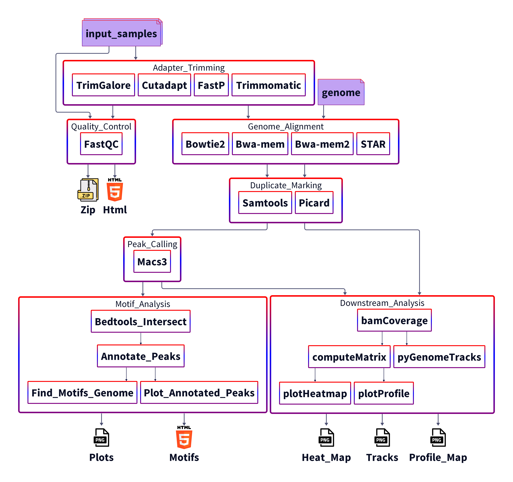

# ChIP-Seq Pipeline

Snakemake reproducible and extensible chromatin immunoprecipitation sequencing data analysis pipeline.

# Usage

## Conda

Installation of conda and snakemake is required to run the pipeline. 

Install conda by following the instructions provided by the official conda [documentation](https://docs.conda.io/projects/conda/en/stable/user-guide/install/index.html)

Then install snakemake by running:

`conda create snakemake -n snakemake -c conda-forge -c bioconda`

Activate the environment and start using the pipeline:

`conda activate snakemake`

Inside the git repository run:

`snakemake -c <num_cores> -j <num_jobs> -C <config_options>`

## Apptainer/Singularity

Using Singularity and Apptainer it is possible run the pipeline without installing Snakemake and conda locally.

Run:

`apptainer pull container_name docker://arnasrum/chippipeline`

Snakemake together conda is available for use in the container.

Run the pipeline by running the following commands inside the git repository:

`./container.sif -c <num_cores> -j <num_jobs> -C <config_options>`

or more explicitly

`apptainer exec container.sif snakemake --sdm conda --conda-frontend conda -c <num_cores> -j <num_jobs> -C <config_options>`

N.B. remember to bind the working directory if it is outside the home directory.

### Running on HPC

Pull the container from Dockerhub using Apptainer/Singularity.

Because compute nodes can have limited access to the internet, provide the samples and genome as local files.

Install conda packages before submitting jobs to compute nodes by running:

`apptainer exec <container_name> snakemake --use-conda --conda-create-envs-only`

Then you can submit the pipeline to the workload manager, e.g. using Slurm

`srun --nodes <num_nodes>... apptainer run <container_name> ...`

## Specify samples 

<table>
    <th>Column</th>
    <th>Description</th>
    <th>Required</th>
    <tr>
        <td>Mark</td>
        <td>Identifier for transcription factor or histone mark for treatment file.</td>
        <td>Yes, only for treatment samples. Leave blank for control samples.</td>
    </tr>
    <tr>
        <td>Sample</td>
        <td>The biological sample or condition the sequences were derived from.</td>
        <td>Yes, used for associating samples with corresponding sample origin.</td>
    </tr>
    <tr>
        <td>Type</td>
        <td>Specifies whether the sample is treatment or control.</td> 
        <td>Yes</td>
    </tr>
    <tr>
        <td>Peak_type</td>
        <td>Must be narrow/broad, decides if the peak caller will treat the sample as narrow or broad peaks.</td>
        <td>Yes, for treatment files. Can be omitted for control files.</td>
    </tr>
    <tr>
        <td>Accession</td>
        <td>GEO accession number for publicly available samples, used to download the sample from GEO if a local file path is not specified. If file_path is specified, this column serves as a prefix for the filename.</td>
        <td>Yes; if file_path is not defined.</td>
    </tr>    
    <tr>
        <td>File_path</td>
        <td>Paths to the reads sample reads. If paired_end is set to true, then two paths must be defined in the column by separating them with ";" character. Files without file_path specified will try </td>
        <td>No, but necessary when using local files instead of downloaded GEO samples.</td>
    </tr>

</table>

## Editing Config 

Refer to the [configuration documentaion](docs/conf.md).

## Module Options

Overwrite the default configuration by running:

`snakemake -c <num> <rule> --config modules="--flag1 <value1> --flag2 <value2>"`

## Flags

**-t** or **--trim** overwrites the trimmer

**-a** or **--align** overwrites the aligner

**-g** or **--genome** sets the reference genome to be aligned to

